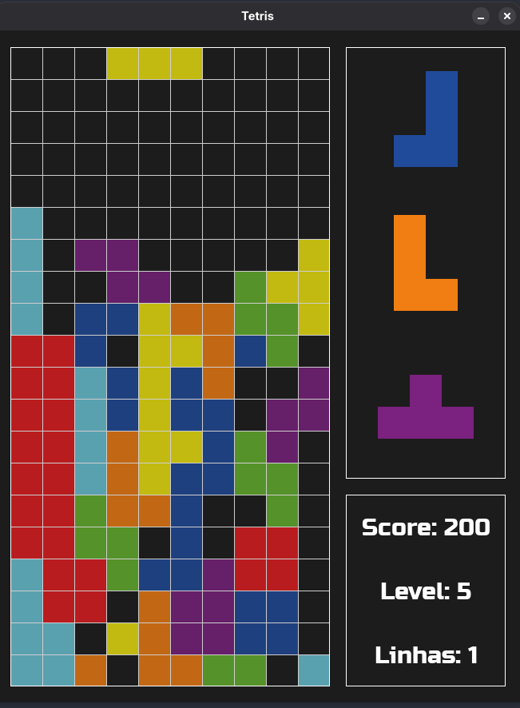

## Projeto Final - Tetris

A ideia do projeto final foi desenvolvedor um jogo para consolidar o aprendizado que tivemos ao longo da cadeira, usando para isso a biblioteca pygame.

### Como baixar
Para poder jogar o jogo na sua máquina, basta dar um fork no projeto, além de ser necessário baixar a biblioteca pygame, usando o comando no terminal:    
pip install pygame

### Modo de jogar
O modo de jogo escolhido foi o uso do WASD ao invés das setinhas:
- w: rotaciona as peças
- a: movimenta a peça para a esquerda
- d: movimenta a peça para a direita
- s: movimenta a peça para baixo mais rápido enquanto a tecla é pressionanda

### Sistema de pontuação
Pontua-se no jogo a partir das linhas completadas e o nível em que o jogador esteja. Assim, quanto mais linhas completadas de uma vez e quanto maior o seu nível, maior a pontuação que você conseguirá alcançar 
dentro do jogo.

### Considerações Finais
Por conta do tempo em que o projeto foi feito, não consegui colocar algumas ideias que eu tinha em mente para o jogo, como um menu de entrada, uma tela de gameover e um sistema de pontuação que trouxesse
o conceito de "melhor recorde" para o jogo, podendo o jogador se desafiar para poder conseguir uma pontuação maior. Assim, irei continuar trabalhando no projeto para que possa trazer essas coisas para o jogo,
deixando-o mais robusto.

### Preview do projeto

